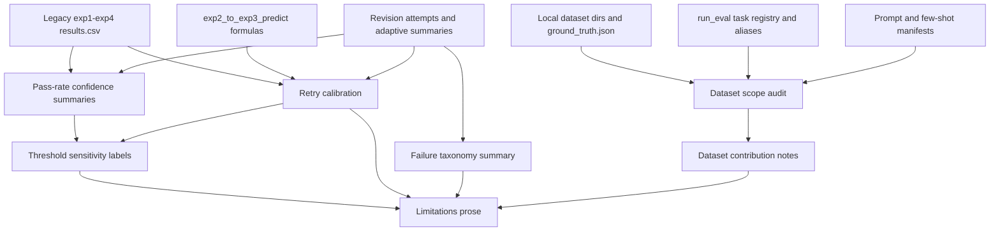

# Phase 03: Dataset Scope, Statistical Confidence, and Limitations - Research

**Researched:** 2026-05-19  
**Domain:** Offline dataset audit, binomial uncertainty, threshold sensitivity, retry calibration, and paper-limitation artifacts  
**Confidence:** HIGH

<user_constraints>
## User Constraints (from CONTEXT.md)

### Locked Decisions
## Implementation Decisions

### Extended Dataset Strategy

- **D-01:** Use a selective extended-dataset strategy rather than a wholesale replacement of the original dataset.
- **D-02:** Combine two expansion routes: add samples to some existing task categories where sample size is underpowered, and add new CAPTCHA task categories to test whether conclusions extend beyond the original type set.
- **D-03:** New categories do not have to match the original CaptchaWorld taxonomy exactly. If no exact category match is available, the artifact may describe them as new CAPTCHA types using clear task-language labels.
- **D-04:** Prefer adding at least two new categories if feasible. A single new category is acceptable only if availability or timeline makes two categories impractical, and that limitation must be stated.
- **D-05:** Choose expansion targets pragmatically: prioritize categories that are feasible to collect, label, normalize, and evaluate without derailing the revision timeline.

### Experiment Rerun Scope

- **D-06:** Do not merge old and new data and rerun every experiment end-to-end by default.
- **D-07:** Run experiments on the newly added data as a selective validation slice, then compare the new-data outcomes against the original-data conclusions.
- **D-08:** The central question for the extended dataset is: do the conclusions drawn from the original dataset still hold on the new dataset slice?
- **D-09:** Selectively supplementing existing categories should be used to reduce sample-size caveats; adding new categories should be used to test broader pattern generalization.

### Adaptive Attacker on Extended Dataset

- **D-10:** Adaptive attacker evaluation may be run on the extended dataset.
- **D-11:** Adaptive-on-extended should be scoped as a validation slice, not a requirement to reproduce every historical experiment across every old and new task.
- **D-12:** If adaptive-on-extended is run, it must preserve the Phase 2 threat model: offline dataset instances, binary pass/fail feedback only, explicit local policy-memory notes, no ground-truth labels or corrective hints, and append-only adaptive attempt records.
- **D-13:** If time forces prioritization, adaptive-on-extended should focus on the most claim-relevant new or supplemented categories rather than broad coverage.

### Statistical and Claim Framing

- **D-14:** The extended dataset should strengthen credibility and generalizability language, not erase CaptchaWorld limitations or imply population-level deployment estimates.
- **D-15:** Extended-data comparisons should be framed as selective validation of recurring structural patterns, with sample counts, task-category definitions, and compatibility caveats visible in the artifact.
- **D-16:** The paper should distinguish original-dataset evidence, supplemented-category evidence, and new-category evidence rather than collapsing them into one undifferentiated dataset claim.

### Threshold Sensitivity Labels

- **D-17:** Phase 3 must produce threshold-sensitivity labels as a first-class artifact, not only prose.
- **D-18:** Align with the submitted paper by carrying forward the existing `40%` working CAPTCHA threshold as the primary cutoff.
- **D-19:** Do not describe `+/- 5%` as an existing paper rule. Phase 3 should instead use a `30%-50%` threshold-sensitive review band to catch tasks near the paper's 40% cutoff, including cases like `Geometry_Click` that sit below 40% but trend upward.
- **D-20:** Threshold outputs must report each task or family label as hard, borderline/near-broken, or broken; its margin relative to the `40%` cutoff; whether it falls in the `30%-50%` review band; and whether trend evidence makes the conclusion threshold-sensitive.
- **D-21:** Trend-sensitive cases should be flagged when a task is below `40%` but moves materially upward under optimized prompts, few-shot prompts, retry, adaptive, or extended-dataset evaluation.
- **D-22:** Confidence intervals should be treated as contingency or appendix-ready statistical backup for possible reviewer follow-up, not as the main manuscript emphasis for this phase. The main paper emphasis should be the statistical impact of dataset imbalance, sample counts, underpowered categories, and threshold-sensitive interpretation.
- **D-23:** The artifact and paper-ready prose must explicitly state that the `40%` cutoff is an operational reporting heuristic, not a universal CAPTCHA security boundary; the `30%-50%` band is a revision-time caution band, not a new security tier.

### Retry Calibration and Failure Taxonomy

- **D-24:** Phase 3 must produce retry-calibration artifacts that align Bernoulli `Success@k` predictions with observed retry outcomes and adaptive-compatible outcomes where available.
- **D-25:** Prediction-error outputs should be task-type primary, with optional family-level summaries for interpretation. At minimum, include provider, model, task type, task family, Exp2 `Pass@1`, attempt budget `k`, Bernoulli predicted `Success@k`, observed fixed-retry success if available, observed adaptive-compatible success if available, signed error (`observed - predicted`), absolute error, sample count, and failure counts.
- **D-26:** Adaptive-compatible calibration should preserve Phase 2's comparison contract: task type is the primary unit, adaptive runs use the same attempt budget when compared, and structural bottleneck tags remain explanatory rather than the primary evaluation unit.
- **D-27:** Failure-taxonomy summaries must separate scientific model failures from protocol failures and infrastructure failures. Infrastructure or provider/runtime errors must not be counted as evidence of structural CAPTCHA robustness.
- **D-28:** Calibration and paper-ready summaries should report both `raw_observed_rate` and `scientific_rate`: `raw_observed_rate` transparently reflects all run outcomes, while `scientific_rate` excludes protocol/infrastructure failures and is the preferred basis for main paper claims about model/CAPTCHA behavior.
- **D-29:** Failure-taxonomy outputs should expose counts and rates for `scientific_wrong`, `protocol_failure`, and `infrastructure_failure`, and should state how each class affects inclusion in pass-rate, retry-calibration, threshold, and limitation claims.
- **D-30:** If a task or family appears hard primarily because of infrastructure or protocol failures, the paper-ready summary must attach a caveat rather than treating it as a structural MLLM failure.

### Claude's Discretion

- The planner may choose exact artifact filenames and CLI flag names for the dataset audit, extended-data manifest, comparison table, and limitations prose generator.
- The planner may choose the exact confidence-interval method and where it appears in artifacts, provided CI material is documented, appropriate for small sample counts, and positioned as contingency or appendix-ready backup rather than the main manuscript thread.
- The planner may choose the exact minimum sample-count threshold for "underpowered" task families, provided the threshold is explicit and surfaced in outputs.
- The planner may choose which existing Phase 2 adaptive comparison utilities to reuse or extend, provided Phase 2 schemas and threat-model semantics remain intact.
- The planner may refine the exact trend-sensitive flag logic, provided it preserves margin-to-cutoff reporting, the `30%-50%` review band, and does not turn the cutoff into a universal security claim.
- The planner may choose the exact retry-calibration table layout, provided the required prediction-error and failure-taxonomy fields are present.

### Deferred Ideas (OUT OF SCOPE)
## Deferred Ideas

- Full SOTA/larger-benchmark integration with Halligan, Oedipus, specialized solvers, or larger external benchmark adapters belongs to Phase 4.
- Full reruns of every historical experiment across a merged old-plus-new dataset are not required for Phase 3 unless planning identifies a narrow, claim-critical reason.
- Formal human-subjects usability validation remains out of scope for this milestone.
</user_constraints>

<phase_requirements>
## Phase Requirements

| ID | Description | Research Support |
|----|-------------|------------------|
| STAT-01 | Researcher can generate a dataset scope audit that reports included, excluded, incompatible, and underpowered CAPTCHA task families with sample counts and reasons. | Use `captcha_data/<TaskType>/ground_truth.json`, `run_eval.SUPPORTED_TYPES`, alias maps, prompt/few-shot keys, and current result coverage to build `dataset_scope_audit.csv/json`. [VERIFIED: run_eval.py, captcha_data inventory, .planning/REQUIREMENTS.md] |
| STAT-02 | Dataset documentation identifies the two removed CaptchaWorld task types and explains why they are incompatible with the evaluation pipeline. | The repository contains `captcha_data/Hold_Button(Not Used)` and `captcha_data/Slide_Puzzle(Not Used)` with ground truth but neither is in `SUPPORTED_TYPES`; document temporal hold and drag/slider interaction incompatibility with the static answer schemas. [VERIFIED: captcha_data inventory, run_eval.py] |
| STAT-03 | Dataset contribution notes cover cleaning, standardization, label and metadata alignment, answer-format normalization, removal of incompatible task types, and task-family grouping. | Generate `dataset_contribution_notes.md` from the audit plus an extended-data manifest that records source, slice type, normalization decisions, family, and removal rationale. [VERIFIED: 03-CONTEXT.md, visualize_results.py] |
| STAT-04 | Pass-rate summaries include confidence intervals by task and task family. | Use Wilson score intervals for binomial pass rates, implemented with stdlib math/statistics to avoid new dependencies, and compute both task-level and family-level rows. [CITED: https://www.itl.nist.gov/div898/handbook/prc/section2/prc241.htm] |
| STAT-05 | Threshold-based hard/borderline/broken labels report their margin relative to the paper's operational cutoff and flag threshold-sensitive families without treating the cutoff as a universal security boundary. | Extend/complement `adaptive_compare.classify_rate()` with Phase 3 fields: `margin_to_cutoff`, `in_30_50_review_band`, `trend_sensitive`, and cutoff caveat. [VERIFIED: adaptive_compare.py, 03-CONTEXT.md] |
| STAT-06 | Existing Exp2-to-Exp3 retry predictions are compared against observed retry or adaptive-compatible outcomes, including prediction error by task family. | Reuse `predict_q_from_exp2()` and `predict_A_from_exp2()` and join Exp2, Exp3, adaptive summary, and family metadata into `retry_calibration.csv/json`. [VERIFIED: exp2_to_exp3_predict.py, adaptive_compare.py] |
| STAT-07 | Revision artifacts and prose distinguish scientific model failures from provider exceptions, timeouts, malformed responses, and other infrastructure errors, and state that CaptchaWorld supports structural-pattern claims rather than population-level deployment estimates. | Consume Phase 2 `failure_class` fields where available; do not infer scientific hardness from aggregate-only legacy CSVs; generate `limitations_summary.md` with dataset-scope and failure-taxonomy caveats. [VERIFIED: adaptive_artifacts.py, adaptive_attacker.py, 03-CONTEXT.md] |
</phase_requirements>

## Summary

Phase 3 should be planned as an offline analysis/artifact phase, not as a broad evaluator rewrite or full historical rerun. [VERIFIED: 03-CONTEXT.md] The concrete work is to add scripted outputs that audit dataset scope, quantify pass-rate uncertainty, label threshold sensitivity around the paper-facing 40% operational cutoff, calibrate Bernoulli retry predictions against observed retry/adaptive-compatible outcomes, and generate limitation prose that prevents population-level overclaiming. [VERIFIED: .planning/REQUIREMENTS.md, .planning/ROADMAP.md, 03-CONTEXT.md]

The current repository already has most implementation seams needed for Phase 3: task support and aliases in `run_eval.py`, result loading and family metadata in `visualize_results.py`, Bernoulli retry formulas in `exp2_to_exp3_predict.py`, adaptive summary/comparison schemas in `adaptive_artifacts.py`, and failure classification in `adaptive_attacker.py`. [VERIFIED: run_eval.py, visualize_results.py, exp2_to_exp3_predict.py, adaptive_artifacts.py, adaptive_attacker.py] The new code should be focused root-level CLI scripts with Pydantic-backed CSV/JSON outputs under `results/revision/<run_id>/`. [VERIFIED: pyproject.toml, revision_artifacts.py, adaptive_artifacts.py, 03-CONTEXT.md]

**Primary recommendation:** Implement three small, scriptable Phase 3 utilities: `dataset_scope_audit.py`, `statistical_confidence.py`, and `retry_calibration.py`, plus an optional `limitations_summary.py` prose generator that reads their machine-readable outputs. [VERIFIED: local code shape, 03-CONTEXT.md]

## Project Constraints (from AGENTS.md)

- Keep interactive discussion with the user in Chinese, but keep planning documents, code comments, generated reports, and project artifacts in English. [VERIFIED: AGENTS.md]
- Keep experiments offline and dataset-based; do not build live CAPTCHA attack automation or browser automation against real services. [VERIFIED: AGENTS.md]
- Treat `secrets.yaml` as sensitive local configuration; do not print, quote, copy, summarize, or commit credential values. [VERIFIED: AGENTS.md]
- Prefer reproducible scripted artifacts over notebook-only manual state. [VERIFIED: AGENTS.md]
- Preserve existing experiment semantics unless a phase explicitly plans a migration. [VERIFIED: AGENTS.md]
- Avoid broad refactors unless they protect experiment correctness, reproducibility, or artifact integrity. [VERIFIED: AGENTS.md]
- Before costly experiments, validate dataset/task filters, prompt/few-shot hashes, provider/model labels, request counts, output directory behavior, and per-attempt logging. [VERIFIED: AGENTS.md]

## Architectural Responsibility Map

| Capability | Primary Tier | Secondary Tier | Rationale |
|------------|--------------|----------------|-----------|
| Dataset scope audit | Offline Python analysis | Dataset storage | The audit reads local `captcha_data`, task registries, prompt/few-shot manifests, and result coverage without provider calls. [VERIFIED: run_eval.py, tests/test_task_contracts.py] |
| Extended dataset manifest | Dataset storage | Offline Python analysis | New/supplemented slices need durable source, normalization, compatibility, and family metadata before any run consumes them. [VERIFIED: 03-CONTEXT.md] |
| Pass-rate CI summaries | Offline Python analysis | Result storage | Confidence intervals are derived from existing aggregate/attempt rows and should be output as CSV/JSON. [VERIFIED: visualize_results.py, revision_artifacts.py] |
| Threshold sensitivity | Offline Python analysis | Paper artifact layer | Labels derive from pass rates and trend evidence; prose must carry the operational-cutoff caveat. [VERIFIED: adaptive_compare.py, 03-CONTEXT.md] |
| Retry calibration | Offline Python analysis | Result storage | Prediction formulas already live in `exp2_to_exp3_predict.py`; Phase 3 adds observed-vs-predicted diagnostics. [VERIFIED: exp2_to_exp3_predict.py] |
| Failure taxonomy | Offline Python analysis | Adaptive artifact storage | Phase 2 records `scientific_wrong`, `protocol_failure`, and `infrastructure_failure`; Phase 3 should aggregate and explain them without hiding counts. [VERIFIED: adaptive_artifacts.py] |
| Optional adaptive-on-extended validation | Provider execution boundary | Adaptive artifact storage | If run, it must reuse Phase 2 preflight, binary feedback, explicit memory, and append-only adaptive outputs. [VERIFIED: 02-VERIFICATION.md, adaptive_preflight.py, adaptive_attacker.py] |

## Standard Stack

### Core

| Library | Version | Purpose | Why Standard |
|---------|---------|---------|--------------|
| Python | `>=3.10`; local `3.11.5` | CLI scripts, stdlib math/statistics, path handling | Project requires Python >=3.10 and local environment satisfies it. [VERIFIED: pyproject.toml, `python3 --version`] |
| pandas | `1.5.3` | Load/merge result CSVs, group by task/family, write table outputs | Existing visualization and prediction code already use pandas. [VERIFIED: pyproject.toml, `uv run python importlib.metadata`] |
| numpy | `1.24.3` | Numeric retry formulas and vectorized data transforms | Existing retry prediction and visualization code already use numpy. [VERIFIED: pyproject.toml, exp2_to_exp3_predict.py] |
| pydantic | `2.13.4` | Validate new Phase 3 row schemas and JSON payloads | Phase 1/2 artifacts already use Pydantic `BaseModel` schemas. [VERIFIED: pyproject.toml, revision_artifacts.py, adaptive_artifacts.py] |
| PyYAML | `6.0.2` | Read prompt/few-shot manifests for audit alignment | Existing preflight and tests load YAML manifests. [VERIFIED: pyproject.toml, revision_preflight.py, tests/test_task_contracts.py] |
| stdlib `statistics.NormalDist` | Python stdlib | Compute configurable normal quantiles for Wilson intervals without SciPy | Python documents `NormalDist.inv_cdf()` for inverse normal CDF values. [CITED: https://docs.python.org/3.10/library/statistics.html] |

### Supporting

| Library | Version | Purpose | When to Use |
|---------|---------|---------|-------------|
| pytest | `9.0.3` | Offline unit/regression tests | Add tests for CI formulas, dataset audit rows, threshold labels, retry calibration joins, and failure taxonomy. [VERIFIED: pyproject.toml, tests/] |
| ruff | `0.15.13` | Static linting | Run after Phase 3 scripts/tests are added. [VERIFIED: pyproject.toml, `uv run ruff --version`] |
| matplotlib/seaborn | `3.7.1` / `0.12.2` | Optional figure inputs if Phase 3 adds charts | Phase 3 requirements are table/prose-first; use only if the planner chooses a figure-ready artifact. [VERIFIED: pyproject.toml, visualize_results.py] |

### Alternatives Considered

| Instead of | Could Use | Tradeoff |
|------------|-----------|----------|
| stdlib Wilson implementation | `statsmodels.stats.proportion.proportion_confint(method="wilson")` | `statsmodels` officially supports Wilson intervals, but it is not pinned in this project; adding it increases dependency churn. [CITED: https://www.statsmodels.org/stable/generated/statsmodels.stats.proportion.proportion_confint.html] |
| task/family tables in pandas | notebook-only analysis | Notebooks are harder to validate and contradict the project rule to prefer scripted artifacts. [VERIFIED: AGENTS.md] |
| modifying `AdaptiveComparisonRow` for all Phase 3 fields | new Phase 3 schemas that consume Phase 2 rows | Separate Phase 3 schemas avoid breaking verified Phase 2 contracts. [VERIFIED: 02-VERIFICATION.md, adaptive_artifacts.py] |

**Installation:**

```bash
uv sync
```

**Version verification:** Package versions above were verified from `pyproject.toml` and `uv run python` import metadata in this session. [VERIFIED: pyproject.toml, `uv run python importlib.metadata`]

## Architecture Patterns

### System Architecture Diagram



### Recommended Project Structure

```text
.
|-- dataset_scope_audit.py          # STAT-01/02/03 dataset support and contribution notes
|-- statistical_confidence.py       # STAT-04/05 pass-rate CI and threshold labels
|-- retry_calibration.py            # STAT-06 observed-vs-predicted retry/adaptive diagnostics
|-- limitations_summary.py          # STAT-07 paper-ready limitations prose from generated tables
|-- phase3_artifacts.py             # Pydantic row schemas and shared CSV/JSON writers, if useful
|-- tests/
|   |-- test_dataset_scope_audit.py
|   |-- test_statistical_confidence.py
|   `-- test_retry_calibration.py
`-- results/revision/<run_id>/
    |-- dataset_scope_audit.csv
    |-- dataset_scope_audit.json
    |-- dataset_contribution_notes.md
    |-- pass_rate_confidence.csv
    |-- threshold_sensitivity.csv
    |-- retry_calibration.csv
    |-- failure_taxonomy.csv
    `-- limitations_summary.md
```

### Pattern 1: Dataset Scope Audit as Registry Cross-Check

**What:** Compare `captcha_data` directories, `ground_truth.json` counts, `run_eval.SUPPORTED_TYPES`, aliases, prompt keys, few-shot keys, and result coverage. [VERIFIED: run_eval.py, tests/test_task_contracts.py]  
**When to use:** First Phase 3 plan, before any extended-dataset run or paper text. [VERIFIED: 03-CONTEXT.md]  
**Example:**

```python
# Source: run_eval.py and tests/test_task_contracts.py
canonical = TASK_ALIASES.get(dataset_dir_name, dataset_dir_name)
status = "included" if canonical in SUPPORTED_TYPES else "incompatible"
```

Audit rows should include `dataset_dir`, `canonical_task_type`, `task_family`, `dataset_sample_count`, `evaluated_sample_count_by_experiment`, `support_status`, `underpowered`, `reason`, `answer_format`, and `pipeline_compatibility`. [VERIFIED: captcha_data inventory, run_eval.py, visualize_results.py]

### Pattern 2: Wilson CI for Task and Family Pass Rates

**What:** Compute binomial confidence intervals from `n_success` and `n_attempts` using the Wilson score formula. [CITED: https://www.itl.nist.gov/div898/handbook/prc/section2/prc241.htm]  
**When to use:** Every pass-rate summary row at task and task-family granularity. [VERIFIED: STAT-04 in .planning/REQUIREMENTS.md]  
**Example:**

```python
# Source: NIST Wilson formula; Python NormalDist docs.
from math import sqrt
from statistics import NormalDist

def wilson_interval(successes: int, n: int, confidence: float = 0.95) -> tuple[float | None, float | None]:
    if n <= 0:
        return None, None
    z = NormalDist().inv_cdf(1 - (1 - confidence) / 2)
    p = successes / n
    denom = 1 + z * z / n
    center = (p + z * z / (2 * n)) / denom
    half = z * sqrt((p * (1 - p) / n) + (z * z / (4 * n * n))) / denom
    return max(0.0, center - half), min(1.0, center + half)
```

### Pattern 3: Threshold Sensitivity Separate from Main Label

**What:** Preserve `hard` / `borderline` / `broken` while adding fields that explain sensitivity: `rate`, `cutoff`, `margin_to_cutoff`, `in_review_band_30_50`, `ci_crosses_cutoff`, and `trend_sensitive`. [VERIFIED: adaptive_compare.py, 03-CONTEXT.md]  
**When to use:** Any row used in paper-facing hard-family or broken-family claims. [VERIFIED: STAT-05 in .planning/REQUIREMENTS.md]  
**Example:**

```python
# Source: adaptive_compare.classify_rate and Phase 3 context.
label = classify_rate(pass_rate, cutoff=0.40, margin=0.0)
margin_to_cutoff = pass_rate - 0.40
in_review_band = 0.30 <= pass_rate <= 0.50
```

### Pattern 4: Retry Calibration Joins by Task Type First

**What:** Join Exp2 `Pass@1`, Bernoulli `Success@k`, observed Exp3/fixed retry, adaptive-compatible outcome, and failure counts by `(provider, model, task_type, attempt_budget_k)`. [VERIFIED: adaptive_compare.py, exp2_to_exp3_predict.py]  
**When to use:** STAT-06 planning and paper appendix/table inputs. [VERIFIED: 03-CONTEXT.md]  
**Example:**

```python
# Source: exp2_to_exp3_predict.py
predicted = predict_q_from_exp2(exp2_pass_at_1, exp2_n, attempt_budget_k)
signed_error = observed_success_at_k - predicted
absolute_error = abs(signed_error)
```

### Anti-Patterns to Avoid

- **Counting provider/runtime errors as model robustness:** Phase 2 explicitly separates `scientific_wrong`, `protocol_failure`, and `infrastructure_failure`; Phase 3 must preserve that separation. [VERIFIED: adaptive_artifacts.py, 03-CONTEXT.md]
- **Treating aggregate legacy CSVs as failure-taxonomy evidence:** Standard `results.csv` rows provide pass rates and counts, but not enough information to distinguish scientific, protocol, and infrastructure failures. [VERIFIED: results headers, run_eval.py]
- **Foregrounding CI-heavy claims in main prose:** Phase 3 context says confidence intervals are backup/appendix-ready, while the main manuscript emphasis is dataset imbalance, sample counts, underpowered categories, and threshold sensitivity. [VERIFIED: 03-CONTEXT.md]
- **Merging old and new data into one undifferentiated claim:** The context requires original, supplemented, and new-category evidence to remain distinguishable. [VERIFIED: 03-CONTEXT.md]
- **Adding new task categories without scorer/schema tests:** Task behavior is encoded across data, prompts, schemas, scorers, and family metadata, so new categories need focused contract tests. [VERIFIED: run_eval.py, tests/test_task_contracts.py]

## Concrete Implementation Seams

| Seam | Current Evidence | Phase 3 Use |
|------|------------------|-------------|
| `run_eval.SUPPORTED_TYPES` | 19 supported task types are registered; `Connect_icon` is aliased to `Connect_Icon`. [VERIFIED: run_eval.py, local inventory] | Define included vs unsupported/incompatible task rows. |
| `captcha_data/*/ground_truth.json` | Active datasets plus `Hold_Button(Not Used)` and `Slide_Puzzle(Not Used)` are present. [VERIFIED: captcha_data inventory] | Count samples and document removals/incompatibilities. |
| `visualize_results.CAPTCHAVisualizer.TASK_FAMILY` | Existing family map groups current task types into Click/Coordinate, Grid Selection, Image Matching, and Logic/Reasoning. [VERIFIED: visualize_results.py] | Seed family-level audit and CI summaries, with explicit overrides if Phase 3 refines taxonomy. |
| `results/exp*/.../results.csv` | Exp1/Exp2/Exp3 have 18 task types; `Select_Animal_Optimized` exists in dataset/support but is absent from current result CSVs. [VERIFIED: local result inventory] | Mark dataset-supported-but-not-evaluated coverage. |
| `exp2_to_exp3_predict.py` | Implements `q = 1 - (1 - p)^k` and expected attempts formulas. [VERIFIED: exp2_to_exp3_predict.py] | Reuse formulas for STAT-06 calibration. |
| `adaptive_artifacts.py` | Defines adaptive summary/comparison rows with failure counts and nullable CI fields. [VERIFIED: adaptive_artifacts.py] | Use as input; do not mutate Phase 2 schemas unless absolutely necessary. |
| `adaptive_compare.py` | Has `classify_rate()` and cutoff note but defers sensitivity review to Phase 3. [VERIFIED: adaptive_compare.py] | Add Phase 3 threshold table around this existing logic. |
| `revision_artifacts.py` | Writes manifests, attempts, and summaries under revision run dirs. [VERIFIED: revision_artifacts.py] | Reuse run-id validation and output root conventions for Phase 3 artifacts. |

## Current Dataset and Result Facts

| Fact | Planning Impact |
|------|-----------------|
| Current active dataset counts include small task pools: `Click_Order` 10, `Patch_Select` 10, `Path_Finder` 10, `Misleading_Click` 10, `Dice_Count` 11, `Geometry_Click` 15, `Coordinates` 18, `Image_Matching` 19. [VERIFIED: captcha_data inventory] | Use an explicit underpowered threshold; recommendation is `dataset_sample_count < 20` or `evaluated_n < 20` at task level. |
| Exp1, Exp2, and Exp3 result CSVs cover 18 task types, while `Select_Animal_Optimized` is supported by code and data but absent from these result rows. [VERIFIED: local result inventory] | Audit should distinguish dataset support from evaluated evidence. |
| `Hold_Button(Not Used)` has `hold_time` and a completed answer, requiring temporal press/hold behavior rather than a static classification/point answer. [VERIFIED: captcha_data/Hold_Button(Not Used)/ground_truth.json] | Document as incompatible with the current static offline answer schema. |
| `Slide_Puzzle(Not Used)` has a component image, target position, tolerance, and drag instruction, requiring slider interaction/composition behavior. [VERIFIED: captcha_data/Slide_Puzzle(Not Used)/ground_truth.json] | Document as incompatible unless the project adds an explicit static proxy task, which Phase 3 does not require. |
| `CAPTCHAVisualizer` currently recursively loads any `results.csv` under `results/`, including `results/error_analysis/openai/gpt-5/results.csv` as an `error_analysis` experiment. [VERIFIED: visualize_results.py, local load output] | Phase 3 loaders should filter experiments explicitly to `exp1`, `exp2`, `exp3`, `exp4`, or revision-run files. |

## Don't Hand-Roll

| Problem | Don't Build | Use Instead | Why |
|---------|-------------|-------------|-----|
| Task support registry | A separate hard-coded task list | `run_eval.SUPPORTED_TYPES`, `TASK_ALIASES`, `DATASET_DIR_ALIASES` | Avoid drift from evaluator and preflight behavior. [VERIFIED: run_eval.py, revision_preflight.py] |
| Task-family map | New family labels without provenance | Start from `CAPTCHAVisualizer.TASK_FAMILY`, then record Phase 3 overrides in output metadata | Keeps plots, comparison rows, and limitation prose aligned. [VERIFIED: visualize_results.py] |
| Bernoulli retry math | Duplicate formulas | `predict_q_from_exp2()` and `predict_A_from_exp2()` | Existing code defines the submitted Bernoulli baseline. [VERIFIED: exp2_to_exp3_predict.py] |
| Adaptive failure classification | Reclassify adaptive rows from raw strings | Existing `failure_class` fields in `AdaptiveAttemptRecord`/`AdaptiveSummaryRow` | Phase 2 verified these fields and their semantics. [VERIFIED: 02-VERIFICATION.md, adaptive_artifacts.py] |
| Output path safety | Manual string concatenation for run directories | `revision_run_dir()` | Existing helper validates run IDs and prevents traversal outside output root. [VERIFIED: revision_artifacts.py] |
| Confidence interval dependency | Add SciPy/statsmodels only for Wilson intervals | Stdlib implementation of Wilson formula | Avoids new dependency risk; NIST provides the formula and Python provides normal quantiles. [CITED: https://www.itl.nist.gov/div898/handbook/prc/section2/prc241.htm; https://docs.python.org/3.10/library/statistics.html] |

**Key insight:** Phase 3 is a provenance and interpretation layer over existing experiment data; custom rerun logic or new provider loops should be optional and narrow. [VERIFIED: 03-CONTEXT.md]

## Common Pitfalls

### Pitfall 1: Blending Dataset Support and Evaluated Evidence
**What goes wrong:** A task exists in `captcha_data` but has no current result rows, or result rows cover only a selected subset. [VERIFIED: local dataset/result inventory]  
**Why it happens:** Existing result CSVs cover 18 task types, while code/data support includes 19 task types. [VERIFIED: run_eval.py, local result inventory]  
**How to avoid:** Report `dataset_sample_count`, `evaluated_n_by_experiment`, and `coverage_status` separately. [VERIFIED: local inventory]  
**Warning signs:** A paper table claims all supported task types were evaluated without an artifact path proving it. [VERIFIED: .planning/REQUIREMENTS.md]

### Pitfall 2: Treating 40% as a Security Law
**What goes wrong:** The hard/broken label reads as a universal CAPTCHA security boundary. [VERIFIED: 03-CONTEXT.md]  
**Why it happens:** `adaptive_compare.classify_rate()` can return simple labels without the broader Phase 3 sensitivity caveat. [VERIFIED: adaptive_compare.py]  
**How to avoid:** Always emit `cutoff_note`, `margin_to_cutoff`, and `in_30_50_review_band`; limitations prose must call the cutoff an operational reporting heuristic. [VERIFIED: 03-CONTEXT.md]  
**Warning signs:** A row says only "hard" or "broken" without margin or review-band metadata. [VERIFIED: STAT-05 in .planning/REQUIREMENTS.md]

### Pitfall 3: CI Outputs Overwhelm the Manuscript Thread
**What goes wrong:** The main paper reads like a CI-method paper instead of a dataset imbalance and threshold-sensitivity response. [VERIFIED: 03-CONTEXT.md]  
**Why it happens:** STAT-04 requires CIs, but the context says they are contingency/appendix-ready backup. [VERIFIED: .planning/REQUIREMENTS.md, 03-CONTEXT.md]  
**How to avoid:** Generate full CI CSV/JSON, but have paper-ready prose default to sample counts, underpowered flags, cutoff margins, and caveats. [VERIFIED: 03-CONTEXT.md]  
**Warning signs:** Main-body prose foregrounds CI method choice more than dataset scope. [VERIFIED: 03-CONTEXT.md]

### Pitfall 4: Inferring Failure Taxonomy from Aggregate Results
**What goes wrong:** Provider timeouts or malformed responses get counted as scientific CAPTCHA hardness. [VERIFIED: 03-CONTEXT.md]  
**Why it happens:** Legacy `results.csv` rows contain aggregate pass rates, not full failure classes; revision v1 attempts only include coarse `error_category`. [VERIFIED: results headers, revision_artifacts.py]  
**How to avoid:** Use adaptive `failure_class` where available; otherwise mark taxonomy as `unknown_or_aggregate_only` and attach a caveat. [VERIFIED: adaptive_artifacts.py]  
**Warning signs:** `scientific_rate` is reported from a source that has no failure-class fields. [VERIFIED: adaptive_artifacts.py, revision_artifacts.py]

### Pitfall 5: Extended Dataset Scope Creep
**What goes wrong:** Phase 3 turns into Phase 4 by integrating external benchmarks or full SOTA solvers. [VERIFIED: 03-CONTEXT.md]  
**Why it happens:** "New categories" can be confused with larger benchmark integration. [VERIFIED: 03-CONTEXT.md, ROADMAP.md]  
**How to avoid:** Use a selective validation slice, record slice metadata, and defer Halligan/Oedipus/specialized-solver work to Phase 4. [VERIFIED: 03-CONTEXT.md]  
**Warning signs:** A plan requires wholesale reruns of every old/new task or imports external solver systems. [VERIFIED: 03-CONTEXT.md]

## Code Examples

### Phase 3 Row Schema Pattern

```python
# Source: revision_artifacts.py and adaptive_artifacts.py schema pattern.
from pydantic import BaseModel, Field

class PassRateConfidenceRow(BaseModel):
    schema_version: str = "cognition.revision.pass_rate_confidence.v1"
    provider: str
    model: str
    experiment: str
    task_type: str
    task_family: str
    n_attempts: int = Field(ge=0)
    n_success: int = Field(ge=0)
    pass_rate: float = Field(ge=0, le=1)
    ci_method: str = "wilson"
    ci_confidence: float = 0.95
    ci_low: float | None = Field(default=None, ge=0, le=1)
    ci_high: float | None = Field(default=None, ge=0, le=1)
```

### Retry Calibration Output Pattern

```python
# Source: exp2_to_exp3_predict.py and adaptive_compare.py.
row = {
    "provider": provider,
    "model": model,
    "task_type": task_type,
    "task_family": task_family,
    "exp2_pass_at_1": p_hat,
    "attempt_budget_k": k,
    "bernoulli_success_at_k": predict_q_from_exp2(p_hat, n, k),
    "observed_success_at_k": observed,
    "signed_error": observed - predicted,
    "absolute_error": abs(observed - predicted),
}
```

### Raw vs Scientific Rate Pattern

```python
# Source: Phase 3 context and adaptive_artifacts.py failure classes.
raw_observed_rate = successes / total_attempts if total_attempts else None
scientific_denominator = successes + scientific_wrong_count
scientific_rate = successes / scientific_denominator if scientific_denominator else None
```

## State of the Art

| Old Approach | Current Approach | When Changed | Impact |
|--------------|------------------|--------------|--------|
| Notebook/statistical side analysis | Scripted CSV/JSON/Markdown artifacts under revision run dirs | Phase 1/2 established artifact contracts by 2026-05-18 | Phase 3 should be reproducible and testable. [VERIFIED: 01-VERIFICATION.md, 02-VERIFICATION.md] |
| Single hard/broken label around 40% | Label plus margin, review band, trend sensitivity, and cutoff caveat | Phase 3 context gathered 2026-05-19 | Prevents overclaiming the cutoff as a universal security boundary. [VERIFIED: 03-CONTEXT.md] |
| Bernoulli prediction as standalone CSV | Calibration table with observed fixed retry/adaptive-compatible outcomes and error fields | Phase 3 requirement STAT-06 | Tests retry-model validity instead of only reporting predictions. [VERIFIED: .planning/REQUIREMENTS.md] |
| Provider/runtime errors mixed into failures | Separate `scientific_wrong`, `protocol_failure`, `infrastructure_failure`, `raw_observed_rate`, and `scientific_rate` | Phase 2/3 contracts | Keeps infrastructure issues out of structural-hardness claims. [VERIFIED: adaptive_artifacts.py, 03-CONTEXT.md] |

**Deprecated/outdated:**

- Treating `+/- 5%` as an existing paper rule is explicitly disallowed; use the `30%-50%` Phase 3 review band instead. [VERIFIED: 03-CONTEXT.md]
- Claiming CaptchaWorld supports population-level deployment estimates is out of scope; frame it as a curated, task-diverse benchmark for recurring structural hardness patterns. [VERIFIED: STAT-07 in .planning/REQUIREMENTS.md, 03-CONTEXT.md]

## Assumptions Log

All claims in this research were verified from local project files, local command output, or cited external documentation; no `[ASSUMED]` claims are intentionally used.

| # | Claim | Section | Risk if Wrong |
|---|-------|---------|---------------|
| None | - | - | - |

## Open Questions

All Phase 3 research open questions are RESOLVED for planning iteration 1.

1. **RESOLVED: Extended categories are selected and configured through the local manifest.**
   - Decision: Phase 3 will not hard-code concrete new CAPTCHA category names in research or plans. The executor will implement `extended_dataset_manifest.py` so a curated local manifest records supplemented categories, new categories, sample counts, normalization decisions, compatibility, evaluation status, and limitations. [VERIFIED: 03-CONTEXT.md]
   - Planning effect: The manifest must require at least one supplemented-category row and at least one new-category row; fewer than two new-category rows requires an explicit `new_category_limitation` explaining availability or timeline constraints. [VERIFIED: 03-CONTEXT.md]

2. **RESOLVED: Adaptive-on-extended is supported as an optional budget-gated validation slice with offline artifact ingestion and comparison.**
   - Decision: Phase 3 must support adaptive-on-extended outcomes when they already exist as offline artifacts, but it does not require a paid provider run. Any adaptive validation slice must preserve Phase 2 semantics: offline dataset instances, binary pass/fail feedback only, explicit local policy-memory notes, no ground-truth labels or corrective hints, and append-only adaptive attempt records. [VERIFIED: 03-CONTEXT.md, 02-VERIFICATION.md]
   - Planning effect: Plans must include selective validation-slice outcome ingestion and original-vs-new comparison artifacts that surface agreement, divergence, and caveats. The comparison may ingest already-produced offline selective validation outputs rather than mandate new paid execution. [VERIFIED: 03-CONTEXT.md]

3. **RESOLVED: The default underpowered threshold is `n < 20`, configurable by CLI.**
   - Decision: Use `n < 20` as the default task-level underpowered flag for dataset scope and statistical outputs unless overridden with `--underpowered-n`. [VERIFIED: local dataset inventory]
   - Planning effect: Dataset audit and confidence-summary rows must expose the threshold used, mark underpowered rows explicitly, and allow a caller override for sensitivity checks. [VERIFIED: 03-CONTEXT.md]

## Environment Availability

| Dependency | Required By | Available | Version | Fallback |
|------------|-------------|-----------|---------|----------|
| Python | All Phase 3 scripts | yes | `3.11.5` | Project supports `>=3.10`; use `uv run python`. [VERIFIED: pyproject.toml, `python3 --version`] |
| uv | Dependency sync and commands | yes | `0.11.14` | Direct Python is possible but less reproducible. [VERIFIED: `uv --version`] |
| pytest | Offline validation | yes | `9.0.3` | None needed. [VERIFIED: `uv run pytest --version`] |
| ruff | Lint validation | yes | `0.15.13` | None needed. [VERIFIED: `uv run ruff --version`] |
| git | Code revision metadata | yes | `2.51.2` | Existing `collect_code_revision()` tolerates git command failures. [VERIFIED: `git --version`, revision_artifacts.py] |
| Provider credentials | Optional extended/adaptive paid slice | not required for research | local secret file must not be inspected | Keep optional paid runs gated by preflight. [VERIFIED: AGENTS.md, adaptive_preflight.py] |

**Missing dependencies with no fallback:** None for offline Phase 3 analysis. [VERIFIED: local environment audit]

**Missing dependencies with fallback:** `statsmodels` is not required because Wilson intervals can be implemented with stdlib math/statistics. [CITED: https://docs.python.org/3.10/library/statistics.html]

## Security Domain

### Applicable ASVS Categories

| ASVS Category | Applies | Standard Control |
|---------------|---------|------------------|
| V2 Authentication | no | Phase 3 does not add user authentication. [VERIFIED: phase scope] |
| V3 Session Management | no | Phase 3 CLIs are offline scripts, not session-bearing services. [VERIFIED: phase scope] |
| V4 Access Control | no | No multi-user access control boundary is introduced. [VERIFIED: phase scope] |
| V5 Input Validation | yes | Validate CLI paths, run IDs, schema rows, task names, and JSON/YAML inputs with existing path helpers and Pydantic models. [VERIFIED: revision_artifacts.py, adaptive_artifacts.py] |
| V6 Cryptography | yes, limited | Use SHA-256 helpers for prompt/few-shot provenance; do not add custom crypto. [VERIFIED: revision_artifacts.py] |

OWASP ASVS is an application security verification standard for testing technical controls and secure development requirements. [CITED: https://owasp.org/www-project-application-security-verification-standard/]

### Known Threat Patterns for This Stack

| Pattern | STRIDE | Standard Mitigation |
|---------|--------|---------------------|
| Secret leakage into reports | Information Disclosure | Never read or print `secrets.yaml` in Phase 3; use provider/model labels and hashes only. [VERIFIED: AGENTS.md] |
| Path traversal through run IDs/output paths | Tampering | Reuse `revision_run_dir()` for output paths. [VERIFIED: revision_artifacts.py] |
| Misclassified provider failures become scientific claims | Tampering / Repudiation | Preserve failure taxonomy fields and caveat aggregate-only sources. [VERIFIED: adaptive_artifacts.py, 03-CONTEXT.md] |
| Dataset provenance drift | Repudiation | Write source, slice type, hash/count metadata, normalization decisions, and compatibility status into the extended-data manifest. [VERIFIED: 03-CONTEXT.md] |

## Sources

### Primary (HIGH confidence)

- `AGENTS.md` - project-specific language, offline experimentation, secret-safety, and reproducibility rules.
- `.planning/phases/03-dataset-scope-statistical-confidence-and-limitations/03-CONTEXT.md` - locked Phase 3 decisions and scope.
- `.planning/REQUIREMENTS.md` - STAT-01 through STAT-07.
- `.planning/ROADMAP.md` - Phase 3 goal, dependency, and success criteria.
- `.planning/STATE.md` - current project position and Phase 3 focus.
- `.planning/phases/02-adaptive-attacker-main-body-evidence/02-CONTEXT.md` and `02-VERIFICATION.md` - Phase 2 threat model, output contracts, and verified adaptive workflow.
- `run_eval.py` - task registry, aliases, build/scoring contracts, revision output integration.
- `revision_artifacts.py` and `revision_preflight.py` - run manifest, attempts, summaries, run-id validation, and preflight pattern.
- `adaptive_artifacts.py`, `adaptive_attacker.py`, `adaptive_compare.py`, and `adaptive_preflight.py` - adaptive schemas, failure classes, comparison rows, and Phase 2 preflight/run contracts.
- `exp2_to_exp3_predict.py` - Bernoulli Success@k and expected-attempt formulas.
- `visualize_results.py` - result loader and task-family metadata.
- `tests/` - current pytest patterns and fake/offline validation approach.
- Local inventories run during research - dataset counts, result headers/types, dependency versions, and environment versions.

### Secondary (MEDIUM confidence)

- NIST/SEMATECH e-Handbook, "Confidence intervals" - Wilson formula and exact interval discussion: https://www.itl.nist.gov/div898/handbook/prc/section2/prc241.htm
- NIST Dataplot Proportion Confidence Interval reference - Wilson/Jeffreys recommendations and references: https://www.itl.nist.gov/div898/software/dataplot/refman1/auxillar/propconf.htm
- Python 3.10 `statistics.NormalDist.inv_cdf()` documentation - normal quantile support in stdlib: https://docs.python.org/3.10/library/statistics.html
- statsmodels stable `proportion_confint` documentation - confirms Wilson support if dependency is later chosen: https://www.statsmodels.org/stable/generated/statsmodels.stats.proportion.proportion_confint.html
- OWASP ASVS project page - ASVS security verification standard reference: https://owasp.org/www-project-application-security-verification-standard/

### Tertiary (LOW confidence)

- None.

## Metadata

**Confidence breakdown:**

- Standard stack: HIGH - verified from `pyproject.toml`, installed package metadata, and current tests. [VERIFIED: pyproject.toml, local environment audit]
- Architecture: HIGH - existing files and Phase 2 verification show concrete integration seams. [VERIFIED: 02-VERIFICATION.md, local code inspection]
- Statistical method: MEDIUM-HIGH - Wilson method is cited from NIST and can be implemented locally; exact manuscript emphasis remains a planning choice. [CITED: https://www.itl.nist.gov/div898/handbook/prc/section2/prc241.htm; VERIFIED: 03-CONTEXT.md]
- Pitfalls: HIGH - grounded in current code/result inventories and locked Phase 3 decisions. [VERIFIED: local inventory, 03-CONTEXT.md]

**Research date:** 2026-05-19  
**Valid until:** 2026-06-18 for local code seams; 2026-05-26 for external documentation and dependency-version currency.
